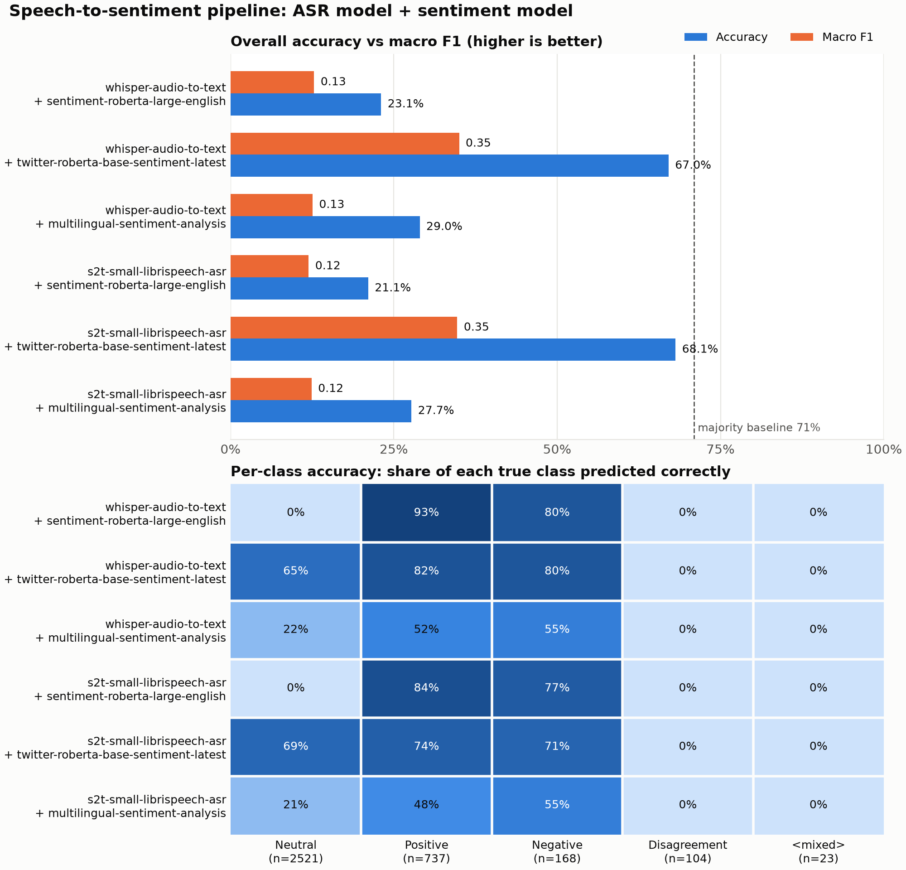
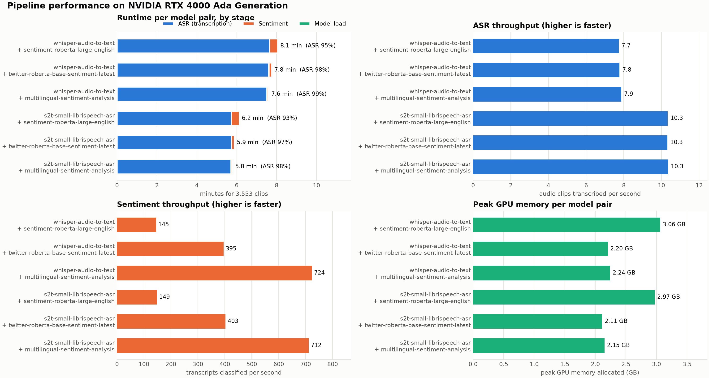

# Speech-to-sentiment results on SLUE-VoxCeleb

Each voice clip goes through a speech recognition model, and the transcript then goes through a text sentiment model. I ran every combination of two speech models and three sentiment models over the 3,553 clips in the SLUE-VoxCeleb test split, on one NVIDIA RTX 4000 Ada with 19.5 GB of memory. Two figures came out of it, one for accuracy and one for cost, and this note reads both panel by panel.

For speech, the candidates were a Whisper fine-tune published by AventIQ and Facebook's small Speech2Text model trained on LibriSpeech. For sentiment: SiEBERT, a large RoBERTa fine-tuned for English sentiment, the Cardiff NLP Twitter RoBERTa, and a small multilingual sentiment model from Tabularis AI.

## Accuracy figure

### Top panel: accuracy against macro F1

Accuracy is the share of all 3,553 clips labelled correctly. Macro F1 averages the F1 score across the five classes with equal weight, so a model that only gets the common class right scores badly on it.

| Speech model | Sentiment model | Accuracy | Macro F1 |
|---|---|---|---|
| Whisper | SiEBERT | 23.1% | 0.13 |
| Whisper | Cardiff NLP Twitter RoBERTa | 67.0% | 0.35 |
| Whisper | Tabularis multilingual | 29.0% | 0.13 |
| LibriSpeech Speech2Text | SiEBERT | 21.1% | 0.12 |
| LibriSpeech Speech2Text | Cardiff NLP Twitter RoBERTa | 68.1% | 0.35 |
| LibriSpeech Speech2Text | Tabularis multilingual | 27.7% | 0.12 |

The six pairs fall into two groups with nothing in between. Cardiff NLP scores 67% to 68% with either speech model. The other four pairs score 21% to 29%. The gap between the groups is about 40 points, and the gap inside each group from swapping the speech model is one to two points. So the sentiment model decides the result, and the speech model is a rounding error.

A dashed line marks the majority baseline at 71%. 2,521 of the 3,553 clips are labelled neutral, so a script that answers neutral every time scores 71% without listening to anything. No pair beats it. Cardiff NLP comes closest and still falls three to four points short.

Macro F1 tells a harsher story than accuracy. Cardiff NLP's 0.35 is the best of the six, and it is still low because two of the five classes are impossible for it. The other four pairs sit at 0.12 to 0.13, which is close to what random guessing across five classes would produce. Note that Tabularis has six to eight points more accuracy than SiEBERT but the same macro F1. The extra accuracy is all neutral clips, and macro F1 does not reward that.

### Bottom panel: per-class accuracy

Each cell is the share of one true class that a pair got right. The columns are ordered by how often each class occurs: neutral (2,521 clips), positive (737), negative (168), disagreement (104), and mixed (23).

SiEBERT scores 0% on neutral in both of its rows. It only ever answers positive or negative, so it cannot be right on 71% of the data no matter how well it reads the transcript. On the clips it can see it is the strongest model in the figure: 93% of positive clips and 80% of negative clips with Whisper transcripts, against Cardiff NLP's 82% and 80% on the same clips. Its low overall accuracy is a label vocabulary problem, not a reading problem.

Cardiff NLP is the only model whose labels match the dataset, and its row is the only one that stays dark across neutral, positive, and negative at once, at 65%, 82%, and 80% with Whisper. It is also the only model where neutral accuracy is not near zero.

Tabularis has a neutral label but rarely uses it, getting only 22% of neutral clips. Two of its five answers, the intensified positive and the intensified negative, never match the dataset's plain labels. Its 52% on positive and 55% on negative are the cases where it chose the plain label instead of the intense one. Reading its row against SiEBERT's, it loses 41 points on positive and 25 on negative, so even after a label mapping it would be the weakest of the three.

Every cell in the disagreement and mixed columns is 0%. None of the three sentiment models has either class, so 127 clips are unwinnable for all six pairs.

The speech model does show up in this panel, even though it barely moves overall accuracy. With SiEBERT, Whisper transcripts score 93% on positive against 84% for LibriSpeech. Cardiff NLP shows the same pattern and adds a twist: Whisper wins positive by eight points (82% against 74%) and negative by nine (80% against 71%), but the LibriSpeech transcripts win neutral by four (69% against 65%). My reading is that Whisper preserves more of the emotional wording, so the sentiment models commit to positive or negative more often. The LibriSpeech model was trained on audiobooks and produces flatter transcripts, which pushes the classifier toward neutral. On this dataset neutral is the majority, so the flatter transcripts win on accuracy by one point while losing on both polar classes. That is the class imbalance flattering the worse transcript.

## Performance figure

### Runtime per model pair, by stage

The top-left panel stacks the three stages of each run in minutes, with transcription first, then sentiment classification, then model loading. Transcription is between 93.2% and 98.6% of every bar. Sentiment classification is 1.1% to 6.5%. Model loading is 0.3% to 0.4%, about 1.3 seconds per pair, too thin to see, because the weights were already cached from earlier runs.

Whisper pairs took 7.6 to 8.1 minutes and LibriSpeech pairs 5.8 to 6.2. Whisper's transcription stage averaged 456 seconds against 344 for LibriSpeech, a ratio of 1.33. Within each speech model the transcription times agree to within eight seconds across the three sentiment models, which is what you would expect since the sentiment model has no influence on that stage.

Within a speech model, the sentiment stage is the only thing that differs between bars. SiEBERT adds 24 seconds, Cardiff NLP 9, and Tabularis 5. So the longest pair (Whisper with SiEBERT, 8.1 minutes) and the shortest Whisper pair (Whisper with Tabularis, 7.6 minutes) differ by only 20 seconds, all of it from the sentiment model.

Summed over the six pairs the run took 2,484 seconds, or 41.4 minutes. Transcription accounts for 2,400 of those seconds, sentiment for 76, and loading for 8. Each speech model transcribed the same 3,553 clips three times, once per sentiment model, and produced the same text each time, so 1,600 seconds went to re-transcribing audio that had already been transcribed. Transcribing once per speech model and reusing the text would bring the run to 884 seconds, or about 14.7 minutes.

### Transcription throughput

The top-right panel shows clips transcribed per second. Whisper's three pairs land at 7.73, 7.77, and 7.87, and LibriSpeech's at 10.33, 10.32, and 10.35. Per clip, that is 128 milliseconds for Whisper and 97 for LibriSpeech. The smaller model is 1.33 times faster. The spread inside each group is under two percent, so the measurement is stable and the sentiment model has no effect on it.

This panel and the runtime panel say the same thing from two directions. The 112-second difference in transcription time between the speech models is exactly the throughput gap applied to 3,553 clips.

### Sentiment throughput

The bottom-left panel shows transcripts classified per second, and here the three sentiment models separate cleanly. SiEBERT averages 147 per second, Cardiff NLP 399, and Tabularis 718. Relative to SiEBERT, Cardiff NLP is 2.7 times faster and Tabularis 4.9 times faster. In time per transcript that is 6.8 milliseconds, 2.5, and 1.4.

Parameter count explains the ordering. SiEBERT is a RoBERTa large with about 355 million parameters, Cardiff NLP a RoBERTa base with about 125 million, and Tabularis a distilled multilingual model smaller still. The speech model has no effect here either: within each sentiment model the two rows agree to within three percent.

Even the slowest sentiment model finishes all 3,553 transcripts in 24 seconds. Compared with the 344 to 459 seconds of transcription that precede it, sentiment classification is never the bottleneck, and choosing a faster sentiment model saves at most 20 seconds per pair.

### Peak GPU memory

The bottom-right panel shows the most memory allocated on the GPU during each pair. It splits along the sentiment model, not the speech model. SiEBERT pairs peak at 2.97 and 3.06 GB, while the other four sit between 2.11 and 2.24. On average SiEBERT costs 859 MB more than the other two, which is the price of holding a 355 million parameter model instead of a 125 million parameter one.

Whisper adds 91 to 93 MB over LibriSpeech within every sentiment model, a consistent offset that reflects the size difference between the two speech models. The largest pair uses 15.7% of the card's 19.5 GB and the smallest 10.8%, so memory was never a constraint in this run, and there is room to batch clips rather than send them one at a time.

### Cost against accuracy

Putting the two figures together, the pair that scores best is also close to the cheapest.

| Pair | Accuracy | Macro F1 | Runtime | Peak memory |
|---|---|---|---|---|
| LibriSpeech + Cardiff NLP | 68.1% | 0.35 | 5.9 min | 2.11 GB |
| Whisper + Cardiff NLP | 67.0% | 0.35 | 7.8 min | 2.20 GB |
| LibriSpeech + Tabularis | 27.7% | 0.12 | 5.8 min | 2.15 GB |
| Whisper + Tabularis | 29.0% | 0.13 | 7.6 min | 2.24 GB |
| LibriSpeech + SiEBERT | 21.1% | 0.12 | 6.2 min | 2.97 GB |
| Whisper + SiEBERT | 23.1% | 0.13 | 8.1 min | 3.06 GB |

SiEBERT is the most expensive sentiment model on every axis, 2.7 times slower than Cardiff NLP and 39% heavier in memory, and it gives the lowest accuracy because of its two-label vocabulary. Tabularis is the cheapest and second worst. Cardiff NLP sits in the middle on cost and alone at the top on accuracy. On the speech side, LibriSpeech is a third faster and within two points on every sentiment model, so the extra 112 seconds per pair that Whisper costs buys better per-class numbers on positive and negative but no better overall score.

## What I would change before the next run

Map every model's answers into the dataset's five labels before scoring. Fold the intensified positive and negative answers into plain positive and negative, and ignore capitalisation. Without this, SiEBERT and the Tabularis model are being graded on a vocabulary test they were never entered in, and SiEBERT's 93% on positive clips suggests it would do well on the classes it can name.

Decide what to do with the 127 disagreement and mixed clips. Either drop them from the scoring or count them as neutral, and say which in the write-up.

Transcribe once per speech model and reuse the text across the three sentiment models. That alone takes the run from 41 minutes to about 15.

Keep both speech models for now. Whisper costs 33% more time but wins the positive and negative classes by eight or nine points, and once the label mapping is in place those classes will count for more than they do today.
